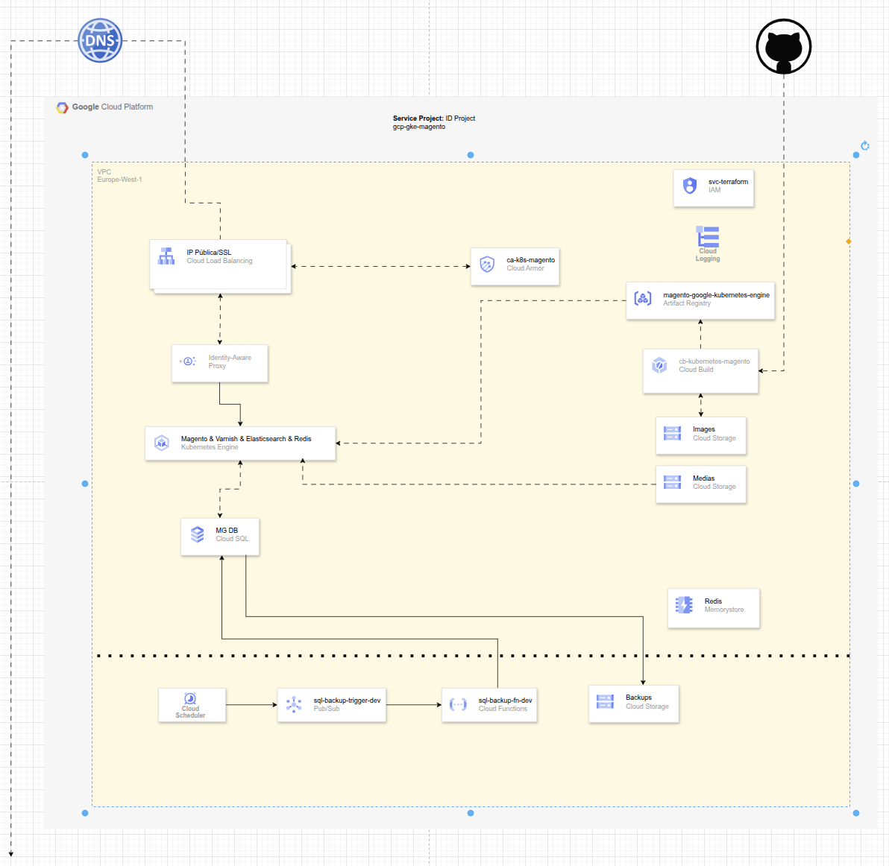
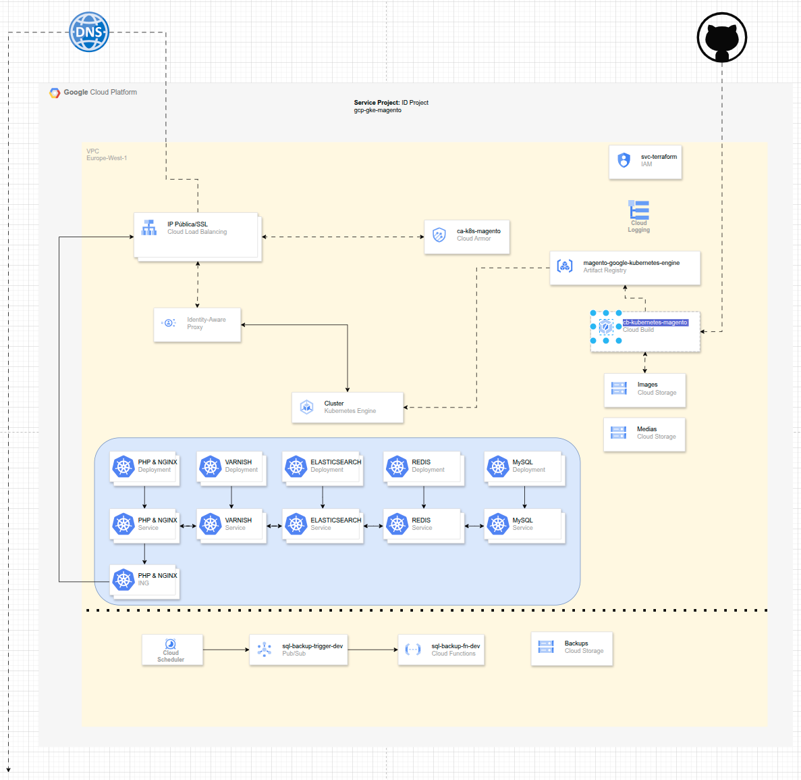

# Magento 2 on Google Kubernetes Engine

Production-grade deployment of Magento 2 on GKE using Terraform. Two deployment variants are documented: one using GCP managed services (Cloud SQL + Memorystore) and one running fully on Kubernetes pods.

---

## Overview

This project demonstrates a cloud-native approach to running Magento 2 on Google Cloud Platform. Infrastructure is fully defined as code with Terraform using a modular design across networking, compute, and data layers.

Key engineering decisions:

- **Sidecar pattern** — Nginx and PHP-FPM share a pod, communicating over a Unix socket for low-latency request handling
- **Varnish as a dedicated cache layer** — deployed as a separate service, configured via ConfigMaps (IaC-managed)
- **Private networking** — all inter-service communication stays within the VPC via Private Service Connect
- **Immutable images** — Docker images are versioned and built via Cloud Build on every push to GitHub

---

## Architecture

### Variant A — GCP Managed Services (recommended)

Uses Cloud SQL (MySQL 8.2) and Memorystore (Redis 7.2) as managed services outside the GKE cluster. Best for production workloads.



### Variant B — Kubernetes Only

All services run as Kubernetes Deployments inside the cluster. Suitable when GCP managed services are not available.



---

## Stack

| Layer | Technology |
|---|---|
| Infrastructure as Code | Terraform (modular) |
| Container Orchestration | Google Kubernetes Engine (GKE) |
| Application server | Magento 2, PHP-FPM, Nginx |
| HTTP cache | Varnish |
| Session & object cache | Memorystore — Redis 7.2 |
| Search | Elasticsearch 7.17 |
| Database | Cloud SQL — MySQL 8.2 |
| CI/CD | Cloud Build + Artifact Registry |
| Security | Cloud Armor (WAF), Identity-Aware Proxy (IAP) |
| Observability | Cloud Logging |
| Media storage | Cloud Storage (GCS) |
| Backups | Cloud Scheduler + Pub/Sub + Cloud Functions |
| Networking | VPC, Private Service Connect, europe-west1 |

---

## Repository Structure

```
.
├── infrastructure/
│   ├── environments/
│   │   └── dev/                  # Terraform root module
│   │       ├── main.tf
│   │       ├── variables.tf
│   │       ├── outputs.tf
│   │       ├── backend.tf
│   │       ├── providers.tf
│   │       └── terraform.tfvars.example
│   └── modules/
│       ├── gke/                  # GKE cluster
│       ├── cloud_sql/            # Cloud SQL (MySQL)
│       ├── redis/                # Memorystore (Redis)
│       └── networking/           # VPC, subnets, secondary IP ranges
├── k8s/                          # Kubernetes manifests
├── docker/                       # Dockerfile and build config
│   └── .env.example
├── setup/                        # Architecture diagrams (draw.io + PNG)
└── src/                          # Magento 2 source
```

---

## Prerequisites

- GCP project with billing enabled
- [Terraform](https://developer.hashicorp.com/terraform/install) >= 1.0
- [gcloud CLI](https://cloud.google.com/sdk/docs/install) authenticated
- [kubectl](https://kubernetes.io/docs/tasks/tools/)
- [Docker](https://docs.docker.com/get-docker/)

Enable the required GCP APIs:

```bash
gcloud services enable \
  container.googleapis.com \
  sqladmin.googleapis.com \
  redis.googleapis.com \
  cloudbuild.googleapis.com \
  artifactregistry.googleapis.com
```

---

## Deployment

### 1. Configure variables

```bash
cd infrastructure/environments/dev
cp terraform.tfvars.example terraform.tfvars
```

Edit `terraform.tfvars` with your `project_id` and desired settings. Then update `backend.tf` with your GCS bucket for Terraform state and your service account.

### 2. Provision infrastructure

```bash
terraform init
terraform plan
terraform apply
```

This creates the VPC, GKE cluster, Cloud SQL instance, and Memorystore. Takes approximately 14 minutes.

### 3. Build and push the Docker image

```bash
docker build -t REGION-docker.pkg.dev/PROJECT_ID/magento/magento2:latest .
docker push REGION-docker.pkg.dev/PROJECT_ID/magento/magento2:latest
```

### 4. Deploy to Kubernetes

Update `k8s/pods.yaml` with the Cloud SQL and Redis IPs from the Terraform outputs, then:

```bash
kubectl apply -f k8s/
```

### Local development

```bash
cd docker
cp .env.example .env
# Edit .env with your local values
docker compose up
```

---

## Security

| Control | Implementation |
|---|---|
| WAF | Cloud Armor policy `ca-k8s-magento` attached to the Load Balancer |
| Admin panel | Identity-Aware Proxy — requires authenticated Google account |
| Private networking | GKE, Cloud SQL, and Redis communicate over private VPC only |
| Terraform identity | Dedicated service account `svc-terraform` |

---

## Backups

Automated database backups on a scheduled trigger:

```
Cloud Scheduler → sql-backup-trigger-dev (Pub/Sub) → sql-backup-fn-dev (Cloud Functions) → Cloud Storage (Coldline)
```

---

## Author

[rocasna](https://github.com/rocasna)
